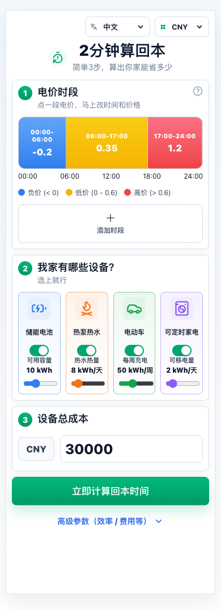
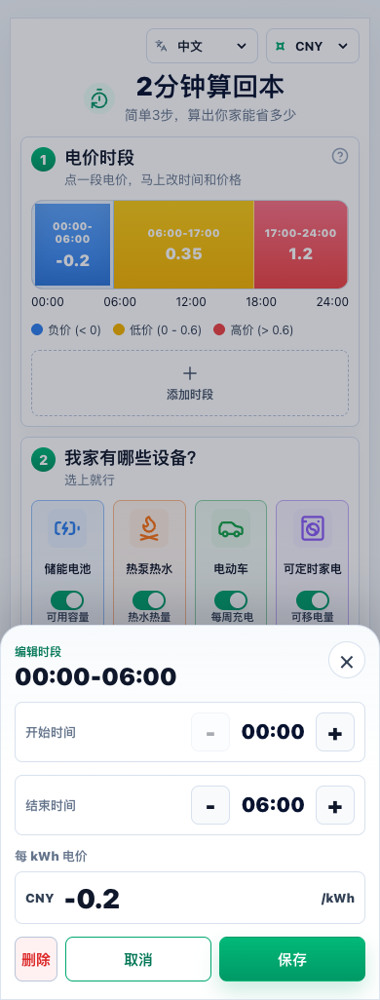
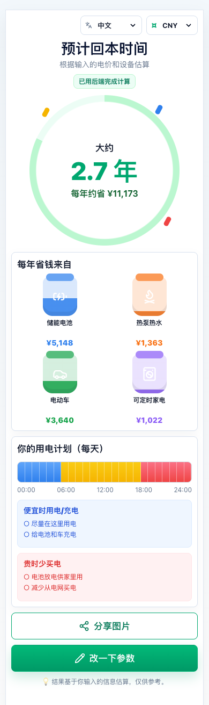

<p align="right">
  <a href="./README.md">English</a> · <strong>简体中文</strong>
</p>

# 家庭用电回本计算器



家庭用电回本计算器是一个移动端优先的网页应用，用来估算家庭在分时电价下调整用电时间后，一年大概能省多少钱，以及设备投入大概几年能回本。它适合凌晨负电价、白天低价、傍晚高价这类一天内价格变化明显的用电场景。

用户先填写一天 24 小时的电价，再选择家里有哪些可以灵活安排用电时间的设备，并填写设备成本和效率参数。系统会分别估算储能电池、热泵热水、电动车充电和可预约家电的年节省贡献，最后计算总投入的预计回本时间。

它采用的思路很直接：便宜时段尽量充电或运行设备，昂贵时段尽量减少从电网买电，再根据可移动电量和电价差估算年节省。这个项目适合做说明、比较和产品演示，不是电费账单保证，也不能代替完整的能源工程仿真。

## 在线演示

打开 GitHub Pages 静态演示：

**[进入家庭用电回本计算器](https://jiexiaozhang1.github.io/energy-payback-calculator/)**

静态演示支持完整的参数填写、本地计算、结果展示、语言切换、货币格式切换和分享图片生成。GitHub Pages 不能运行 Express，因此保存分享方案等后端功能，需要在本地完整运行项目，或者部署到支持 Node.js 的平台。

本地体验完整前后端：

```bash
npm install
npm run build
npm run start
```

然后打开 `http://localhost:8787`。

## 页面截图

### 输入页和电价概览


### 电价编辑器



### 计算结果页



### 桌面宽屏布局


每张图的具体内容可以查看[中文截图索引](docs/SCREENSHOTS.zh-CN.md)。

## 这个应用解决什么问题

这个应用回答的是一个很具体的问题：

> 如果一个家庭能把部分用电挪到更便宜的时间段，一年大概能省多少钱？为了实现这件事购买的设备，大概多久能回本？

Demo 主要考虑四类可以调整用电时间的家庭设备：

1. **储能电池**：低价时充电，高价时放电，减少高价时段从电网购电。
2. **热泵或热水负荷**：结合热泵性能系数，把部分制热需求安排到更便宜的时段。
3. **电动车充电**：把每周需要的充电量尽量安排在低价时段。
4. **可预约家电**：把洗衣、洗碗等可延后运行的负荷移出高峰时段。

它不是一张只供观看的静态效果图，而是一个可以实际操作的网页应用。项目包含电价编辑、输入状态保存、前端和后端两套计算、方案保存和恢复、PNG 分享图片生成、五种界面语言以及多种货币显示格式。

## 核心使用流程

1. **编辑一天的电价。**
   例如设置 00:00-06:00 为负电价、06:00-17:00 为低价、17:00-24:00 为高价。编辑器会把输入整理成完整的 24 小时电价表，并自动合并价格相同的相邻时段。

2. **选择可调度设备。**
   只开启家里实际拥有的设备。滑块用于设置对应的可移动电量，单位会显示为 kWh/天或 kWh/周。

3. **填写投入成本。**
   默认流程只需要填写设备总成本。高级设置中也可以把成本分别分配给已开启的设备。

4. **调整技术参数。**
   可调参数包括电池往返效率、每天完整充放电次数、热泵 COP，以及按设备拆分的成本。

5. **开始计算。**
   前端会优先请求 Express API。如果后端不可用，浏览器会自动使用同一套本地计算逻辑完成估算。

6. **查看和分享结果。**
   结果页会显示预计回本时间、预计年节省、各设备节省贡献、简单的每日用电建议、分享图片，以及后端可用时的方案分享链接。

需要现场讲解项目时，可以直接使用[中文展示流程](docs/DEMO.zh-CN.md)。

## 默认示例结果

使用项目内置的示例电价和默认设备参数时，计算结果大致如下：

| 指标 | 估算值 |
|---|---:|
| 每年节省 | 11,173 |
| 设备投入 | 30,000 |
| 预计回本时间 | 2.7 年 |
| 储能电池贡献 | 每年 5,148 |
| 热泵或热水贡献 | 每年 1,363 |
| 电动车充电贡献 | 每年 3,640 |
| 可预约家电贡献 | 每年 1,022 |

这些数值用于展示模型，不代表某个真实家庭一定能得到相同结果。货币切换只会改变符号和数字格式，不会按实时汇率换算金额。

## 计算方法

前端和后端各自实现了同一套计算逻辑：

- 前端：`src/lib/calculations.ts`
- 后端：`server/calculations.js`

整体计算步骤如下：

1. 规范化用户填写的电价时段。
2. 把电价展开成 24 个小时价格。
3. 找出相对便宜和相对昂贵的时段。
4. 估算每个已开启设备的可移动电量。
5. 计算低价时段用电成本与高价时段可避免购电成本之间的正向差额。
6. 根据电池效率、热泵 COP 等设备参数调整估算。
7. 把各设备节省折算成年节省。
8. 汇总得到总年节省。
9. 用设备投入成本除以年节省，得到预计回本年限。

这个模型有意保持清楚易懂。它没有模拟天气、真实家庭负荷曲线、光伏上网限制、电池衰减、设备功率上限、电网费用、税费、补贴或实时市场结算。

公式、数据结构、API 和部署行为详见[中文技术说明](docs/TECHNICAL_OVERVIEW.zh-CN.md)。

## 项目结构

```text
energy-payback-calculator
├── src/
│   ├── App.tsx                   # React 应用和页面流程
│   ├── styles.css                # 移动端优先界面样式
│   └── lib/
│       ├── calculations.ts       # 浏览器端计算逻辑
│       ├── tariffEditor.ts       # 电价编辑和规范化
│       ├── i18n.ts               # 界面多语言文案
│       ├── defaults.ts           # 默认状态和选项
│       ├── storage.ts            # LocalStorage 状态保存
│       ├── api.ts                # Express API 客户端
│       ├── shareImage.ts         # Canvas PNG 图片生成
│       └── types.ts              # 前端共用类型
├── server/
│   ├── index.js                  # Express API 和静态文件服务
│   └── calculations.js           # 后端计算逻辑
├── docs/
│   ├── assets/                   # 中文和英文页面截图
│   ├── DEMO.zh-CN.md             # 中文展示流程
│   ├── PITCH.zh-CN.md            # 中文演说稿
│   ├── SCREENSHOTS.zh-CN.md      # 中文截图索引
│   └── TECHNICAL_OVERVIEW.zh-CN.md # 中文技术说明
├── data/
│   └── .gitkeep                  # 运行时方案 JSON 不提交
└── package.json                  # 命令、元数据和依赖
```

### 前端

前端使用 React、TypeScript、Vite、Framer Motion 和 Lucide 图标，主要负责：

- 渲染移动端优先的输入页和结果页。
- 编辑和校验一天 24 小时的电价。
- 管理设备开关、滑块、成本输入和高级参数。
- 使用 LocalStorage 保存计算器状态。
- 后端可用时请求计算 API。
- API 不可用时自动改用浏览器本地计算。
- 展示带动画的结果数字和内容区块。
- 使用 Canvas 生成可以分享的 PNG 图片。
- 切换界面语言和货币显示格式。
- 根据网址中的方案参数恢复已保存的输入和结果。

### 后端

后端是一个小型 Express 服务，提供四个接口：

| 方法 | 路径 | 用途 |
|---|---|---|
| `GET` | `/api/health` | 检查服务是否可用 |
| `POST` | `/api/calculate` | 根据用户输入计算节省和回本 |
| `POST` | `/api/scenarios` | 保存输入和结果快照 |
| `GET` | `/api/scenarios/:id` | 读取已保存的方案 |

保存的方案会写入 `data/*.json`。这些属于运行时数据，已被 Git 忽略，不会进入公开仓库。

## 本地运行

运行要求：

- Node.js 18 或更高版本
- npm

安装依赖：

```bash
npm install
```

同时启动前端和后端开发服务：

```bash
npm run dev:full
```

构建并运行本地生产版本：

```bash
npm run build
npm run start
```

打开 `http://localhost:8787`。

为当前仓库的 GitHub Pages 子路径构建：

```bash
VITE_BASE_PATH=/energy-payback-calculator/ npm run build
```

## 验证项目

运行自动测试：

```bash
npm test
```

构建生产版本：

```bash
npm run build
```

可选的依赖安全检查：

```bash
npm audit --omit=dev
```

项目发布前已通过 7 个测试文件、34 项测试和生产构建验证。

## 完整文档

所有项目资料都按语言独立存放，同一份文档中不会交叉排列中英文说明。

中文文档：

- [项目说明](README.zh-CN.md)
- [展示流程](docs/DEMO.zh-CN.md)
- [演说稿](docs/PITCH.zh-CN.md)
- [技术说明](docs/TECHNICAL_OVERVIEW.zh-CN.md)
- [截图索引](docs/SCREENSHOTS.zh-CN.md)

每份文档顶部都有语言入口，点击后可以打开对应的完整英文版本。

## 已知限制

这个项目是演示级估算工具，适合产品展示、概念解释和粗略比较，但不能作为工程设计建议、投资建议或电费账单保证。

目前的主要限制包括：

- 不支持实时导入电价。
- 不按实时汇率换算货币。
- 没有详细的家庭负荷曲线。
- 没有光伏发电和上网模型。
- 没有电池衰减曲线。
- 没有按设备建立充放电功率限制。
- 没有税费、补贴、电网附加费或需量电费模型。
- 没有用户账号和在线数据库。
- GitHub Pages 无法运行 Express API，也无法持久保存分享方案。

## 安全说明

项目不需要 API 密钥或私有凭据。仓库已忽略环境变量文件、依赖目录、构建产物、本地浏览器产物、运行时方案 JSON、日志和测试覆盖率文件。

主要忽略内容包括：

- `.env` 和 `.env.*`
- `node_modules/`
- `dist/`
- `.playwright-cli/`
- `data/*.json`
- 日志文件
- 测试覆盖率输出

后续如果接入外部服务，不要把密钥或个人方案数据提交到仓库。

## 开源许可

本项目使用 MIT License，详见 [LICENSE](LICENSE)。
