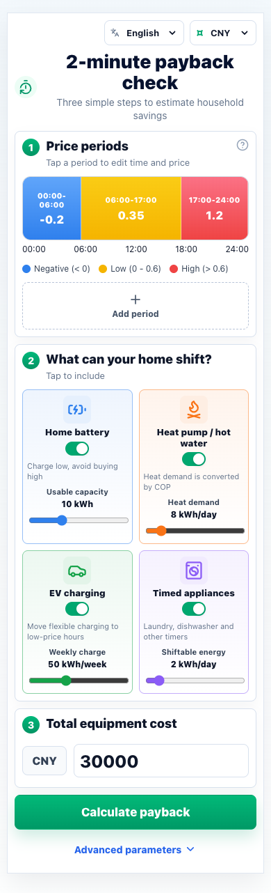
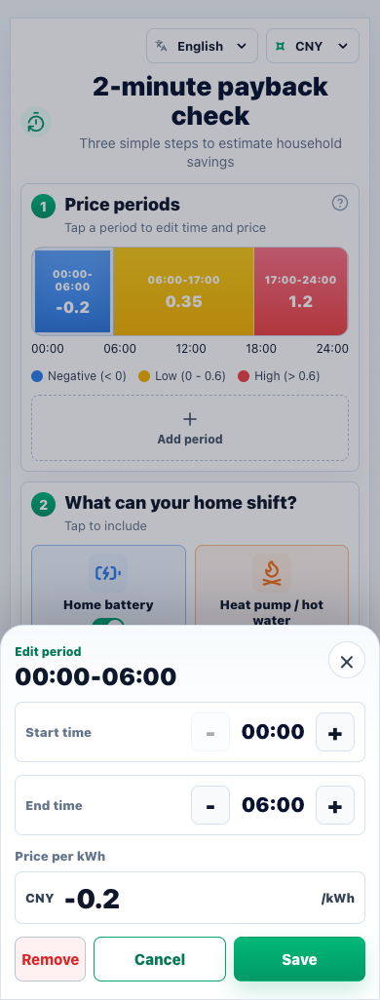
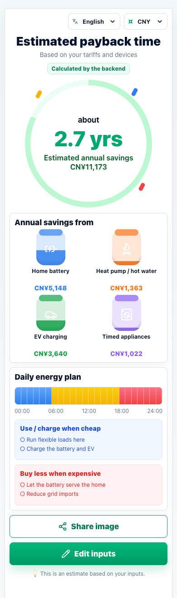
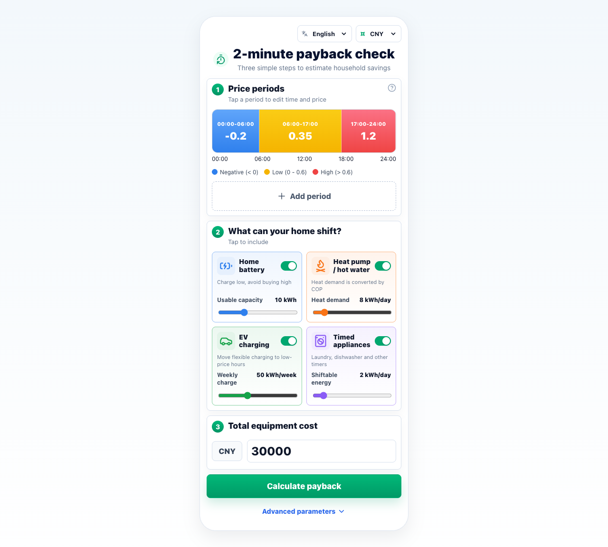

<p align="right">
  <strong>English</strong> · <a href="./SCREENSHOTS.zh-CN.md">简体中文</a>
</p>

# Screenshot Index

This page lists the English screenshots used in the English README and presentation material. Every image was captured from the rendered application rather than assembled as a mockup.

## 1. Input Screen

File: `docs/assets/screenshot-input-en.png`



This screenshot shows:

- English interface mode.
- CNY currency formatting.
- The 24-hour tariff timeline.
- Negative, low, and high-price periods.
- Four flexible device categories.
- Total equipment cost input.
- Advanced settings entry point.
- Main calculation action.

## 2. Tariff Editor

File: `docs/assets/screenshot-tariff-editor-en.png`



This screenshot shows:

- Bottom-sheet editing interaction.
- Start and end hour controls.
- Price-per-kWh input with negative-price support.
- Save, cancel, and delete actions.
- The selected tariff period visible behind the editor.

## 3. Result Screen

File: `docs/assets/screenshot-result-en.png`



This screenshot shows:

- English result copy.
- Estimated payback time.
- Estimated annual savings.
- Result source status.
- Savings by device category.
- Suggested daily energy plan.
- Share and edit actions.

## 4. Desktop Layout

File: `docs/assets/screenshot-desktop-en.png`



This screenshot shows:

- The mobile-first application on a wider desktop viewport.
- A centered and constrained application shell.
- The same complete input workflow without stretching controls across the screen.

## Capture Method

The screenshots were captured from the production build served by the local Express server at:

```text
http://localhost:8787
```

The mobile views use a phone-sized viewport, while the desktop view uses a wider browser viewport. Screenshots are kept in `docs/assets/` so GitHub can render them directly in README and documentation pages.

Return to the [English README](../README.md) or continue with the [English demo walkthrough](DEMO.en.md).
